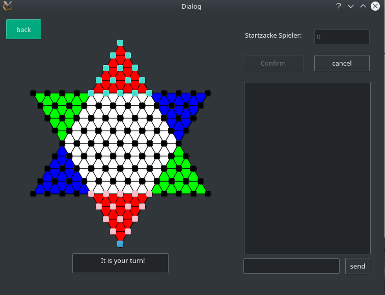
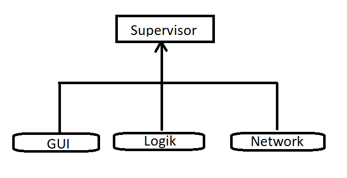

# Halma Game

  

## Main Classes:
* Supervisor
* GUI classes
* Network
* Logik

  

## Main Functions:
#### GUI:
* Create login page
* Halma playing field
* Managment window
* Show movements of stones
#### Logic:
* Save all positions and corresponding players
* Checking the local moves and the opponent's moves
* Review of the winner
#### Network:
* Server
* Client
* Communication between server and client

## Connects between Classes:
* between Logik und GUI
* within the GUI (different windows)
* between Logic und Network
* between GUI und Network

## other features:
* Chat function
* cancel move button
* show current player
