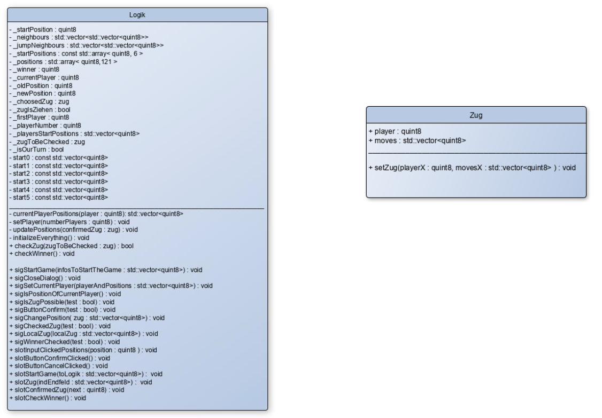
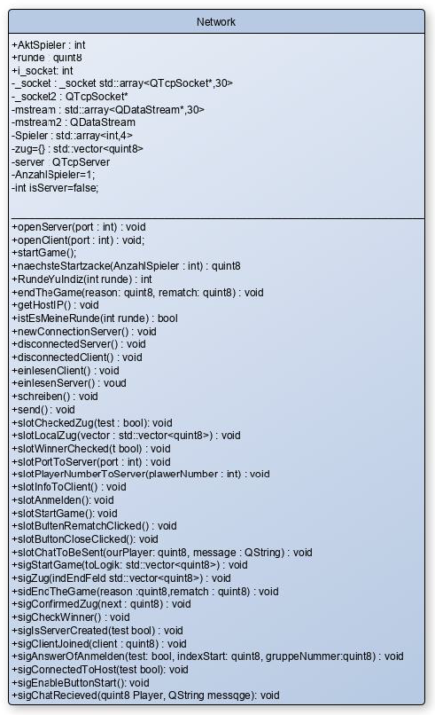
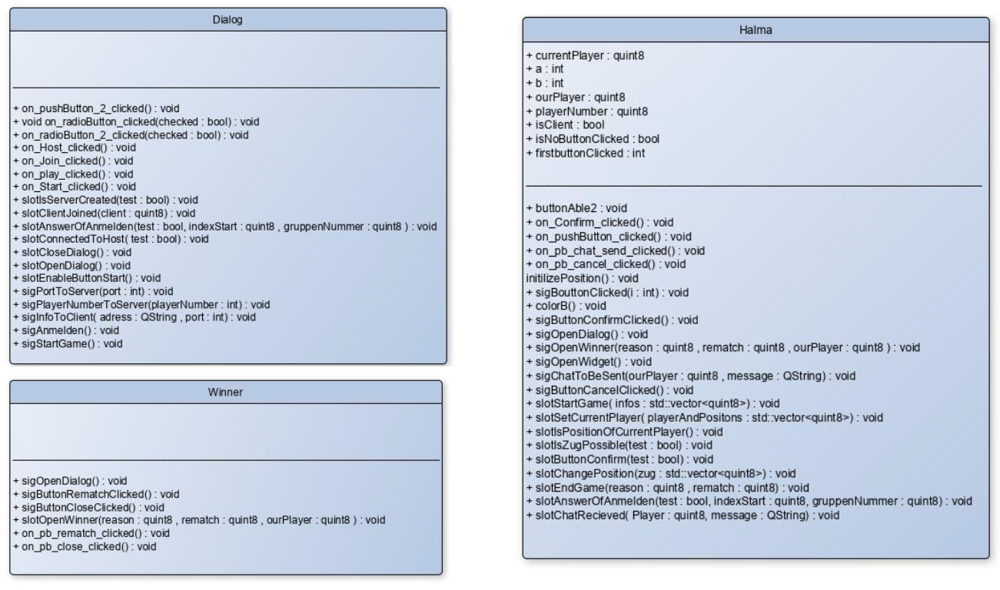

# Halma Game

  

## Main Classes
* Supervisor
* GUI classes
* Network
* Logik

## Main Functions
### GUI
* Create login page
* Halma playing field
* Managment window
* Show movements of stones
### Logic
* Save all positions and corresponding players
* Checking the local moves and the opponent's moves
* Review of the winner
### Network
* Server
* Client
* Communication between server and client

## Connects between Classes
* between Logik und GUI
* within the GUI (different windows)
* between Logic und Network
* between GUI und Network

## Other features
* Chat function
* cancel move button
* show current player

## UML Class Diagrams
#### Logic classes: 

  

#### Network class:

  

#### GUI classes:

  

